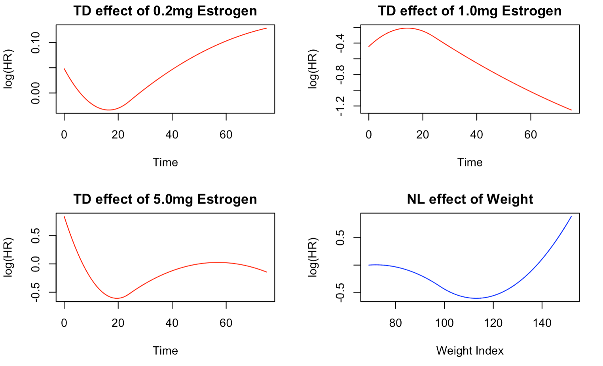
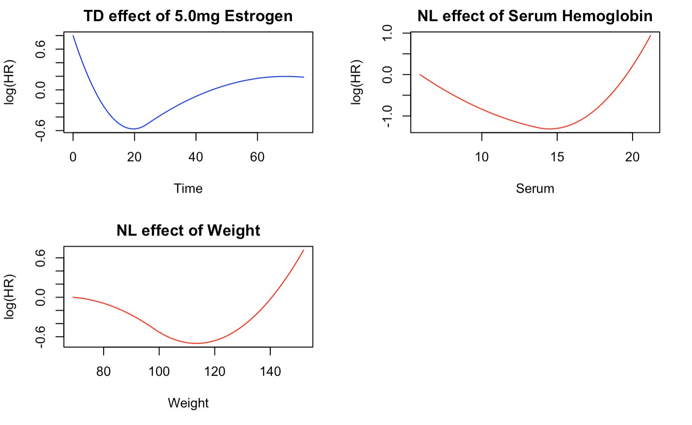

Prostate cancer is the second most common cancer in men worldwide, with the highest incidence in developed countries such as Australia, New Zealand, and North America [1]. According to the American Cancer Society, it is estimated that there will be approximately 248,530 new cases of prostate cancer and 34,130 deaths due to the disease in the United States alone in 2023 [2].

Age is a significant risk factor for prostate cancer, with the majority of cases diagnosed in men aged 65 years or older. In fact, about 60% of all prostate cancer cases are diagnosed in men aged 65 years and older [4]. Other risk factors for prostate cancer include family history, African ancestry, obesity, and a diet high in red and processed meat [3].

There are several treatment options for prostate cancer, including active surveillance, surgery, radiation therapy, hormone therapy, and chemotherapy [4]. The treatment chosen depends on the stage and aggressiveness of the cancer. Active surveillance is typically recommended for patients with low-risk prostate cancer, while surgery and radiation therapy may be recommended for patients with more aggressive forms of the disease. Hormone therapy and chemotherapy are typically used when the cancer has spread beyond the prostate gland [3].

The main goal of this report is to assess the effectiveness of various hormone-based treatments in terms of the survival of patients with prostate cancer. To achieve this, different survival modeling techniques will be utilized, and a comprehensive comparison of these methods will
be presented.

# Methodology 

## Data and variables 

The data used in this study were obtained from Andrews & Herzberg's book [5], and were collected in a randomized controlled trial that investigated the prognostic factors for survival
in patients with prostate cancer. The trial included 502 individuals, who were assigned to one of four treatments: a placebo pill, 0.2 mg diethylstilbestrol (DES), 1.0 mg of DES, or 5.0 mg of DES, which were administered daily by mouth. The dataset contains information on the patients' stage of tumor, the date of randomization, the total months of follow-up since randomization, and an indicator for the survival status or cause of death, along with the values of twelve other pre-treatment covariates, such as age, systolic blood pressure, diastolic blood pressure, etc. The primary outcome of interest was the overall survival of the patients, and the dataset recorded 354 events, where event was death caused by prostate cancer. Since there are many covariates present in the dataset only covariates that are more correlated with prostate cancer survival were included in the model. These include age, weight,systolic bloold pressue, serum hemoglobin, tumor size, cancer stage, cardiovascular disease history, and bone metastasis.

The study aimed to compare the effects of the different treatments on the overall survival of the patients. There were no repeated measurements per participant, and there was no clustering in the data. Additionally, there were no time-varying covariates, and the dataset did not have any missing values.

The trial included patients with stage 3 and 4 prostate cancer, with stage 3 defined as local extension of the disease without evidence of distant metastasis and stage 4 defined as distant metastasis as evidenced by elevated acid phosphatase, x-ray evidence, or both.

## Statistical models 

The study explored four different models including the following:

- Model 1: *COXPH Univariate Model*, where only treatment was included in the survival model, with no adjustment for the covariates;

- Model 2: *COXPH Multivariable Model*, where we model proportional hazard and linear effects of all the covariates;

- Model 3: *Full flexible multivariable model*, which consists of modelling the TD effects of exposure, TD effects of all covariates and NL effects of continuous covariates; and

- Model 4: *Flexible multivariable model with backward selection*, which models the TD/NL of all the covariates with stepwise elimination of non-significant effects (p $>$ 0.05)

Model 4 involves an iterative backward elimination procedure to establish the final flexible model. This procedure begins by fitting the full flexible multivariable model used in Model 3. Then, each of the nonlinear (NL) effects of all continuous covariates and time-dependent
(TD) effects of all covariates are evaluated. During the first iteration of the backward elimination process, the effect with the highest p-value among the TD and NL effects of all covariates is eliminated. In each subsequent iteration, the least significant of the remaining TD and NL effects is removed. This elimination process continues until all the remaining TD and NL effects are statistically significant (p $<$ 0.05).

For the flexible models (Model 3 and Model 4), only one interior knot was used along with quadratic splines for both TD and NL effects. Additionally, the knots were automatically allocated for the NL-effects covariates. All data cleaning and analyses were performed using R
version 4.2.1 statistical software and the models were fit using CoxFlex package [7].

# Results 

The results below show the distribution of covariates and exposure across the events in the dataset. 

#### Table 1: Distribution of events across predictors

|                             | Overall (N=494)   | Died (N=351)      | Did not die (N=143) |
| --------------------------- | ----------------- | ----------------- | ------------------- |
| **Age (years)**             |                   |                   |                     |
| Mean ± SD                   | 71.5 ± 7.04       | 72.0 ± 7.02       | 70.3 ± 6.95         |
| Median [Min, Max]           | 73.0 [48.0, 89.0] | 73.0 [48.0, 89.0] | 72.0 [49.0, 84.0]   |
| **Weight Index**            |                   |                   |                     |
| Mean ± SD                   | 98.9 ± 13.3       | 98.0 ± 13.7       | 101 ± 11.9          |
| Median [Min, Max]           | 98.0 [69.0, 152]  | 97.0 [71.0, 152]  | 100 [69.0, 135]     |
| **Follow-up (months)**      |                   |                   |                     |
| Mean ± SD                   | 35.8 ± 23.3       | 24.9 ± 18.0       | 62.7 ± 7.65         |
| Median [Min, Max]           | 33.5 [0, 76.0]    | 23.0 [0, 74.0]    | 64.0 [50.0, 76.0]   |
| **Treatment**               |                   |                   |                     |
| Placebo                     | 124 (25.1%)       | 94 (26.8%)        | 30 (21.0%)          |
| Estrogen 0.2mg              | 122 (24.7%)       | 94 (26.8%)        | 28 (19.6%)          |
| Estrogen 1.0mg              | 124 (25.1%)       | 71 (20.2%)        | 53 (37.1%)          |
| Estrogen 5.0mg              | 124 (25.1%)       | 92 (26.2%)        | 32 (22.4%)          |
| **Systolic Blood Pressure** |                   |                   |                     |
| Mean ± SD                   | 14.4 ± 2.42       | 14.4 ± 2.41       | 14.2 ± 2.46         |
| Median [Min, Max]           | 14.0 [8.00, 30.0] | 14.0 [8.00, 24.0] | 14.0 [10.0, 30.0]   |
| **Serum Hemoglobin**        |                   |                   |                     |
| Mean ± SD                   | 13.4 ± 1.96       | 13.3 ± 2.07       | 13.8 ± 1.61         |
| Median [Min, Max]           | 13.7 [5.90, 21.2] | 13.6 [5.90, 21.2] | 13.9 [8.20, 16.9]   |
| **Tumor Size**              |                   |                   |                     |
| Mean ± SD                   | 14.6 ± 12.3       | 15.9 ± 13.1       | 11.3 ± 9.37         |
| Median [Min, Max]           | 11.0 [0, 69.0]    | 12.0 [0, 69.0]    | 8.00 [0, 52.0]      |
| **Has CVD History**         |                   |                   |                     |
| No                          | 283 (57.3%)       | 179 (51.0%)       | 104 (72.7%)         |
| Yes                         | 211 (42.7%)       | 172 (49.0%)       | 39 (27.3%)          |
| **Bone Metastasis**         |                   |                   |                     |
| No                          | 413 (83.6%)       | 282 (80.3%)       | 131 (91.6%)         |
| Yes                         | 81 (16.4%)        | 69 (19.7%)        | 12 (8.4%)           |

The study population comprised individuals with a median age of 73.0 years and a median follow-up duration of 33.5 months (range: 0-76 months). The distribution of treatment assignments was balanced across the four groups, with each group constituting approximately 25% of the sample. The median tumor size was 11, ranging from 0 to 69. The covariates were similarly distributed between those who experienced the event and those who did not, with the exception of the follow-up duration, which had a median of 64 months for censored patients and 24 months for deceased patients. This is expected, as patients who died did not have the opportunity to accumulate additional follow-up time. Most surviving patients received 1.0mg of Estrogen, while the other covariates were well-balanced across treatment groups. Notably, a
history of cardiovascular disease and presence of bone metastatis were more prevalent in patients who experienced the event, suggesting they may be important predictors to explore during modeling.

As described in the statistical modeling section, four models were fitted, and the results for Model 1 (a regular Cox proportional hazards model with no covariate adjustment) and Model 2 (a regular Cox proportional hazards model with adjustment for all covariates) are presented below.

#### Table 2: Comparison between Model 1 and Model 2

|                     | Model 1                  | Model 2                  |
| ------------------- | ------------------------ | ------------------------ |
| **Estrogen 0.2mg**  | 1.026 [0.771, 1.366]     | 1 [0.748, 1.336]         |
| **Estrogen 1.0mg**  | **0.678 [0.498, 0.923]** | **0.657 [0.48, 0.899]**  |
| **Estrogen 5.0mg**  | 0.973 [0.73, 1.297]      | 0.907 [0.674, 1.22]      |
| **Age**             | -                        | **1.019 [1.003, 1.036]** |
| **Weight**          | -                        | **0.99 [0.981, 0.999]**  |
| **SBP**             | -                        | 1.002 [0.958, 1.047]     |
| **Serum**           | -                        | **0.936 [0.881, 0.994]** |
| **Tumor size**      | -                        | **1.018 [1.01, 1.027]**  |
| **Stage**           | -                        | 1.125 [0.873, 1.449]     |
| **CVD history**     | -                        | **1.648 [1.326, 2.048]** |
| **Bone metastasis** | -                        | **1.397 [1.001, 1.949]** |
| **AIC**             | ***3969***               | ***3910.12***            |

The findings of the first two models indicate that both 1.0mg and 5.0mg doses of estrogen are associated with a decreased risk of prostate cancer mortality, although only the effect of 1.0mg dose is statistically significant for both models. Upon adjusting for additional covariates in Model 2, the effect of 1.0mg estrogen on reducing the risk of prostate cancer death increases from 32.2% to 34.3% compared to Placebo.

Notably, among the covariates included in Model 2, only Age, Weight, Serum, Tumor size, CVD history, and Bone metastasis exhibit statistical significance.

The covariate analysis reveals the following associations with the risk of death from prostate cancer:

- Age: There is a positive association between age and the risk of death from prostate cancer. For each one-year increase in age, there is a 1.9% increase in the risk of death, after adjusting for all other covariates.

- Weight: While the confidence interval is close to the null, there appears to be a potential inverse association between weight index and the risk of death. For each one-unit increase in weight index, there is a 1.0% reduction in the risk of death. This may be attributed t confounding by other unmeasured or unadjusted covariates.

- Serum: There is an inverse association between serum hemoglobin and the risk of prostate cancer death. For each one-unit increase in serum hemoglobin, there is a 6.4% decrease in the risk of death.

- Tumor size: There is a positive association between tumor size and the risk of death from prostate cancer. For each one-unit increase in tumor size, there is a 1.8% increase in the risk of death, adjusting for all other covariates.

- CVD history: The presence of a history of cardiovascular diseases is significantly associated with an increased risk of death from prostate cancer. Patients with a history of CVD are 64.8% more likely to die from prostate cancer than those without a history of CVD.

- Bone metastasis: While the lower bound of the 95% confidence interval is closer to the null, there appears to be a substantial effect of bone metastasis on the risk of death from prostate cancer. Controlling for all other covariates, patients with bone metastasis have a 39.7% higher risk of death than those without bone metastasis.

After adjusting for all covariates, Model 2 was found to fit the data better than Model 1, as indicated by the lower AIC (3969 vs. 3910.12), as presented in Table 2.

Models 3 and 4 were developed to explore the impact of time-dependent (TD) and nonlinear (NL) effects of the covariates. In Model 3, all covariates were assigned TD effects, while only continuous covariates were assigned NL effects. In Model 4, TD/NL effects were not forced but
were evaluated by the program, and a variable was excluded from the final model if it was not statistically significant (p>0.05). The summary of the comparison of effects is presented in the table below.

#### Table 3. Comparison between Model 3 and Model 4

|                      | Model 3    | Model 4    |
|----------------------|------------|------------|
| **Estrogen 0.2mg**    | TD         | -          |
| **Estrogen 1.0mg**    | TD         | TD         |
| **Estrogen 5.0mg**    | TD         | TD         |
| **Age**               | TD/NL      | PH/LL      |
| **Weight**            | TD/NL      | NL         |
| **SBP**               | TD/NL      | -          |
| **Serum**             | TD/NL      | NL         |
| **Tumor size**        | TD/NL      | PH/LL      |
| **Stage 4**           | TD         | -          |
| **CVD history**       | TD         | PH/LL      |
| **Bone metastasis**   | TD         | PH/LL      |
*Abbreviations: NL: non-linear; TD: time-dependent; PH: proportional hazard*

*Table 4 shows comparison of forced TD/NL effects in Model 3 with selected effects in backward elimination in Model 4. The "-" sign means that the variable wasn't chosen by the backward elimination model.*

According to the results presented in Table 3, the covariates 0.2mg Estrogen, Systolic Blood Pressure, and Stage4 were not deemed significant by the backward elimination model, nor were they statistically significant in Model 2 (Table 3). The only covariate that remained statistically significant in Model 2 and was selected by Model 4 is TD effect of 0.5mg Estrogen.

Among the covariates that were forced to have TD effects in Model 3, only 1.0mg Estrogen and 5.0mg Estrogen were selected by Model 4. Other covariates were either selected to have the standard CoxPH effects or only NL effects. Specifically, NL effects were chosen only for Weight
and Serum Hemoglobin variables.

## Model 3 

In order to perform a thorough comparison between Models 3 and 4, it is imperative to examine the p-values associated with the requested or selected effects in both models. We shall commence by examining the p-values of the requested TD/NL effects for Model 3.

#### Table 4. p-values for effects in Model 3

| Effect                | p-value   |
|-----------------------|-----------|
| **TD-Estrogen 0.1mg** | 0.99      |
| **TD-Estrogen 1.0mg** | 0.56      |
| **TD-Estrogen 5.0mg** | 0.16      |
| **NL-Age**            | 0.46      |
| **TD-Age**            | 0.68      |
| **NL-Weight**         | 0.01      |
| **TD-Weight**         | 0.34      |
| **NL-SBP**            | 0.10      |
| **TD-SBP**            | 0.10      |
| **NL-Serum**          | 0.15      |
| **TD-Serum**          | 0.87      |
| **NL-Tumor Size**     | 0.99      |
| **TD-Tumor Size**     | 0.80      |
| **TD-Stage 4**        | 0.76      |
| **TD-CVD History**    | 0.19      |
| **TD-Bone Metastasis**| 0.66      |
*Abbreviations: NL: non-linear; TD: time-dependent*

The aforementioned p-values reveal that all TD/NL effects are not statistically significant, except for the NL effects of Weight. However, it is worth noting that discarding a variable based solely on its TD/NL statistical significance is not recommended. Further investigation of the TD/NL effects of the three treatments and Weight through visual exploration is important. The TD effects figures can display how the strength of the variable's effect varies over time, while the NL effects figures demonstrate the log(HR) comparing each value of the variable to the selected reference value of the same variable. It should be noted that, in this report, the minimum value of the variable is always used as the reference value for all NL effect figures.

*Figure 1* illustrates the time-varying effects of the three treatments on the risk of prostate cancer death. Notably, the TD effects of the treatments exhibit distinct temporal patterns. For instance, the TD effect of 0.2mg Estrogen reveals an elevated risk of death in the initial months of treatment, gradually decreasing until about 20 months, after which there is a marked rise in risk until the end of the follow-up period. Conversely, the TD effect of 1.0mg of Estrogen shows
an initial high risk of death that drops significantly after about five months, and the risk remains low until the end of the follow-up period. This trend aligns with the results of Models 1 and 2, which indicated that 0.1mg Estrogen significantly reduces the risk of prostate cancer death.

The TD effect of 5.0mg Estrogen shows a similar trend to that of 0.2mg Estrogen, except for a slight protective effect towards the end of follow-up. Additionally, the NL effect of weight index demonstrates that the risk of death is higher for lower weights and decreases as the weight increases until reaching a minimum at around 110 weight index, after which the risk begins to increase again.

## Model 4 

The backward elimination model has selected only a few flexible variables with significant effects, as shown in Table 5. These include the NL effects of weight and serum hemoglobin, as well as the TD effect of 5.0mg Estrogen, which has a p-value of 0.05. Notably, the model suggests that 0.1mg Estrogen does not have a significant effect on the risk of prostate cancer death compared to placebo.

#### Table 5. Model 4 Results with alpha = 0.05 p-values

| Effect                   | Estimate | p-value  |
|--------------------------|----------|----------|
| **PH/LL-Age**             | 1.02     | 0.02     |
| **NL-Weight**             | -        | 0.01     |
| **NL-Serum**              | -        | 0.02     |
| **PH/LL-Tumor Size**      | 1.02     | 0.00     |
| **PH/LL-Estrogen 1.0**    | 0.64     | 0.00     |
| **TD-Estrogen 5.0**       | -        | 0.05     |
| **PH/LL-CVD History**     | 1.62     | 0.00     |
| **PH/LL-Bone Metastasis** | 1.45     | 0.01     |
*The sign "-" means that the effect was chosen by the model and is either TD or NL.*
*Abbreviations: NL: non-linear; TD: time-dependent; PH: proportional hazard*

*Figure 2* provides a visual representation of the TD/NL effects selected by the backward elimination model. The TD effect of 5.0mg Estrogen follows a similar pattern to that described in Figure 1, with an initial high mortality risk in the first few days of treatment, followed by a sharp decrease until around 20 months, and a subsequent increase until the end of follow-up. This could be due to the body initially responding to the drug, followed by the development of drug resistance after 20 months.

The NL effect of serum hemoglobin, with respect to the minimum serum of 5.9mg/dL, shows the lowest risk of death at around 15mg/dL. Patients with this level of serum are less likely to die from prostate cancer than those with the minimum serum. However, the risk of death increases
sharply as the serum hemoglobin level increases from 15mg/dL and decreases as the serum level increases from the minimum.

Similarly, the NL effect for weight follows the same trend as described in Figure 1. The greatest reduction in the risk of death occurs at around 110 weight index, compared to patients with the minimum weight index of 69. The risk of death increases as the weight index rises from 110 and decreases as the weight index increases from the minimum.

## Model Comparison 

Based on the AIC values presented in Table 6, the optimal model for the data is Model 4, which employs the backward elimination method to determine the flexible effects. Conversely, the model without adjusting for other covariates (Model 1) performs the poorest among the fitted models. Moreover, Model 3 has a higher AIC value (representing worse performance) than Model 2, indicating that TD/NL effects were not necessary for all eligible covariates. This was further supported by the selection of only a few variables to have TD/NL effects in Model 4.

#### Table: Comparison of the 4 Models

| Model    | AIC     |
|----------|---------|
| Model 1  | 3969.00 |
| Model 2  | 3910.12 |
| Model 3  | 3941.98 |
| Model 4  | 3894.46 |

# Discussion and Conclusion 

The results of the best fitting model (Model 4) indicate that among the treatments studied, 1.0mg of estrogen is the most effective in prolonging the survival of patients with prostate cancer. Holding all other covariates constant, the administration of 1.0mg estrogen reduces the risk of death by 36% compared to Placebo, and this effect is statistically significant (p=0.00). As noted earlier, patients taking 5.0mg estrogen experience a reduction in the risk of death until approximately 20 months of treatment, after which the risk increases sharply. Therefore, the most effective treatment, when compared to Placebo, is a daily oral dose of 1.0mg estrogen.

Furthermore, other covariates were found to be important predictors of the risk of death in prostate cancer patients. Adjusting for all other variables, patients with a history of cardiovascular disease had a 1.62 times higher risk of death than those without such history (p=0.00). Similarly, those with bone metastasis had a 1.45 times higher risk of death than those without (p=0.01). Age and tumor size were also found to be significant predictors, where a one-unit increase in each variable was associated with a 2% increase in the risk of death (p=0.02 and
p=0.01, respectively).

One strength of this project is the rigorous exploration of different model combinations to identify the best fit for the data. Specifically, the backward selection process allows for the removal of covariates that may correspond to spurious effects and the selection of a parsimonious model with fewer parameters [6]. This approach avoids over-reliance on p-values from simpler models that may lead to erroneous elimination of true effects.

A notable limitation of this project is the computational power required by the backward elimination process [6]. The iterative selection of final parameters using all possible combinations of TD and NL effects can become computationally expensive, especially with multiple variables in the model. Furthermore, due to the unavailability of bootstrap in the
CoxFlex package, confidence intervals could not be outputted. However, p-values have been used as a suitable alternative in Models 3 and 4.

### References

1.  Ferlay J, Soerjomataram I, Dikshit R, et al. Cancer incidence and mortality worldwide: sources, methods and major patterns in GLOBOCAN 2012. _Int J Cancer_. 2015;136(5)
2.  American Cancer Society. Key Statistics for Prostate Cancer. 2022. Available at: [https://www.cancer.org/cancer/prostate-cancer/about/key-statistics.html](https://www.cancer.org/cancer/prostate-cancer/about/key-statistics.html). Accessed September 7, 2024.
3. National Cancer Institute. Prostate Cancer Treatment (PDQ®)-Patient Version. 2022. Available at: [https://www.cancer.gov/types/prostate/patient/prostate-treatment-pdq](https://www.cancer.gov/types/prostate/patient/prostate-treatment-pdq). Accessed September 7, 2024.
4. SEER Cancer Statistics Review. Cancer Stat Facts: Prostate Cancer. 2022. Available at: [https://seer.cancer.gov/statfacts/html/prost.html](https://seer.cancer.gov/statfacts/html/prost.html). Accessed September 7, 2024.
5. Andrews DF, Herzberg AM. Prognostic variables for survival in a randomized comparison of treatments for prostatic cancer. In: _Data_. Springer; 1985:261-274.
6. Wynant W, Abrahamowicz M. Impact of the model building strategy on the inference about time-dependent and non-linear covariate effects in survival analysis. _Stat Med_. 2014;33(19):3318-3337.
7. R Core Team. R: A Language and Environment for Statistical Computing. Vienna, Austria: R Foundation for Statistical Computing; 2021. Available at: [https://www.R-project.org/](https://www.R-project.org/).

